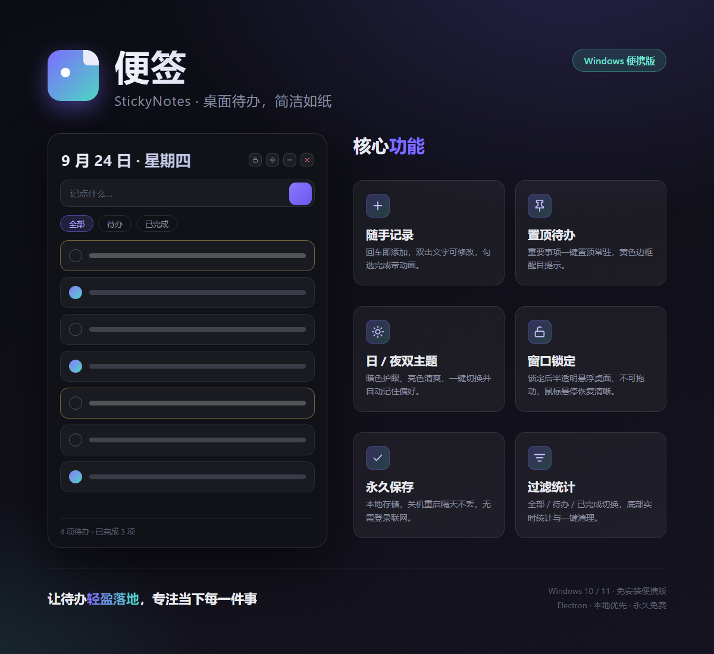

# 便签 · StickyNotes

> 桌面待办便签，简洁如纸。本地优先、永久保存、双主题、窗口锁定。



一款用 Electron 打造的极简桌面待办应用，专注“随手记一条、划掉一条”的纯粹体验。数据全部存在本地，无需登录、无需联网，关机重启隔天不丢。

## 功能

- **随手记录** — 输入框回车即添加，双击文字可修改，勾选完成带打勾动画
- **置顶待办** — 重要事项一键置顶常驻顶部，黄色边框醒目提示
- **日 / 夜双主题** — 暗色护眼、亮色清爽，一键切换并自动记住偏好
- **窗口锁定** — 锁定后半透明悬浮桌面、不可拖动，鼠标悬停恢复清晰
- **永久保存** — 本地存储，关机重启隔天不丢，无需登录联网
- **过滤统计** — 全部 / 待办 / 已完成切换，底部实时统计与一键清理

## 下载

前往 [Releases](../../releases) 下载 `StickyNotes-Portable.exe`（免安装单文件，约 74MB），双击即可运行，无需安装任何环境。

- Windows 10 / 11（x64）
- 首次启动会自解压到临时目录（约 2-3 秒），之后启动更快

## 截图

应用界面与主题见上方宣传图。界面元素：大号日期标题、输入区、过滤标签、待办列表（置顶 / 已完成 / 普通三种状态）、右上角窗口控制（锁定 / 主题 / 最小化 / 关闭）。

## 开发与构建

```bash
# 安装依赖（建议使用国内镜像加速）
npm install --registry=https://registry.npmmirror.com

# 开发运行（注意：若环境设置了 ELECTRON_RUN_AS_NODE，需移除）
env -u ELECTRON_RUN_AS_NODE ./node_modules/.bin/electron .

# 打包成免安装 exe
ELECTRON_MIRROR=https://npmmirror.com/mirrors/electron/ \
ELECTRON_BUILDER_BINARIES_MIRROR=https://npmmirror.com/mirrors/electron-builder-binaries/ \
npm run dist
```

产物：`dist/StickyNotes-Portable.exe`

## 技术栈

- Electron 33（无边框透明窗口 + preload IPC）
- 原生 HTML / CSS / JS，无框架依赖
- electron-builder 打包 portable 单文件
- 数据持久化：localStorage

## License

MIT
